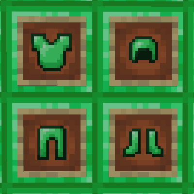

# Emerald Armor

A Fabric mod that adds armor made from emerald blocks.

## Features

Emerald armor is crafted from emerald blocks and is comparable to diamond armor with some differences.

### Armor Stats

| Stat | Emerald | Diamond |
|------|---------|---------|
| Helmet Defense | 3 | 3 |
| Chestplate Defense | 8 | 8 |
| Leggings Defense | 6 | 6 |
| Boots Defense | 3 | 3 |
| **Total Defense** | **20** | **20** |
| Armor Toughness | 2.0 | 2.0 |
| Base Durability | 37 | 33 |

**Highlights:**
- Higher durability than diamond
- Same protection as diamond
- Crafted from emerald blocks (expensive but renewable via villager trading)

## Screenshots

## Crafting

Standard armor crafting patterns using **Emerald Blocks** instead of ingots.

## Pandorical

Emerald Armor uses Pandorical to sync its custom item assets (textures) to clients. Pandorical is required on both the server and every client; there is no vanilla-client fallback. Armor stats and functionality are unaffected either way; Pandorical governs only how the armor is rendered.

## Development

Installing is in [DEVELOPMENT.md](DEVELOPMENT.md).

## License

MIT, see [LICENSE](LICENSE).
